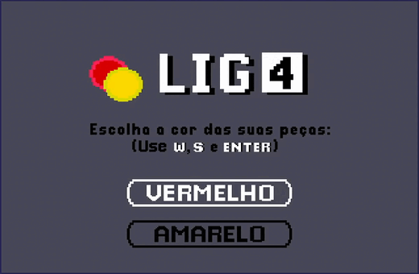

<h1 align="center">
    
</h1>

Implementação do jogo Lig4 em Assembly RISC-V.

* [Sobre o Projeto](#sobre-o-projeto)
* [Execução](#execução)
    * [Usando o FPGRARS](#usando-o-fpgrars)
    * [Usando o RARS](#usando-o-rars)
    * [Controles e Como Jogar](#controles-e-como-jogar)
* [Funcionalidades](#funcionalidades)

--- 

## Sobre o projeto

O projeto consiste em uma recriação do clássico jogo de tabuleiro Lig4 ([Connect4](https://en.wikipedia.org/wiki/Connect_Four)) utilizando como base a ISA RV32IMF do Assembly [RISC-V](https://riscv.org/). O jogo e sua versão alternativa foram desenvolvidos como parte dos laboratórios da discplina de Organização e Arquitetura de Computadores (OAC) ofertada pela [Universidade de Brasília](https://www.unb.br/) durante o semestre 2022/2.

---

## Execução

Para executar o jogo é possível utilizar a ferramenta [RARS](https://github.com/TheThirdOne/rars) ou o [FPGRARS](https://github.com/LeoRiether/FPGRARS), porém o FPGRARS é mais recomendado.

### Usando o FPGRARS

Baixe o executável da última versão ou utilize o FPGRARS contido no repositório, e execute o arquivo `Lig4.s` através do comando `./fpgrars Lig4.s` no terminal ou arrastando o `.s` no executável.

### Usando o RARS

Use o `Rars15_Custom2.jar` contido no repositório, abra o arquivo `Lig4.s`, na barra de menu superior clique em "Run" e depois selecione a opção "Assemble" para montar o programa (ou aperte F3).

Em seguida, na barra de menu superior clique em "Tools" e selecione as opções "Bitmap Display" e "Keyboard and Display MMIO Simulator", conecte ambas ao programa clicando em "Connect to Program".

Por fim, na opção "Run" clique em "Go" para executar o jogo (ou aperte F5). O jogo será renderizado na janela da ferramenta "Bitmap Display" e todos os inputs do teclado devem ser digitados na parte inferior da janela do "Keyboard and Display MMIO Simulator".

### Controles e Como Jogar

Nos menus use `w` ou `s` para movimentar entre as opções e `ENTER(↵)` para selecionar uma. 

No tabuleiro use `a` ou `d` para escolher uma coluna e `ENTER(↵)` para inserir a peça. Com `p` é possível terminar a partida e voltar para o menu inicial.

---

## Funcionalidades    

Assim como no jogo original é possível escolher uma entre duas cores de peça para jogar contra o seu adversário. No caso desse projeto o oponente será o próprio programa, que escolhe dinamicamente qual será o seu próximo movimento de acordo com as jogadas do usuário. 

O jogo possui 3 níveis de dificuldade crescente: Fácil, Médio e Díficil, que mudam a maneiro com que esse oponente joga. Na mais fácil o programa escolhe as colunas de forma randômica, mas nas próximas dificuldades o adversário começa a tentar expandir seus grupos de peças ao mesmo tempo que tenta impedir que o jogador ganhe. 

    

Para jogar ambos escolhem uma das setes colunas do tabuleiro para inserir uma peça, que desce até a última posição livre. Vence quem formar primeiro um grupo de 4 peças da sua cor, seja na diagonal, vertical ou horizontal. Caso nenhum grupo seja formado até que o tabuleiro esteja cheio o jogo termina em empate.

